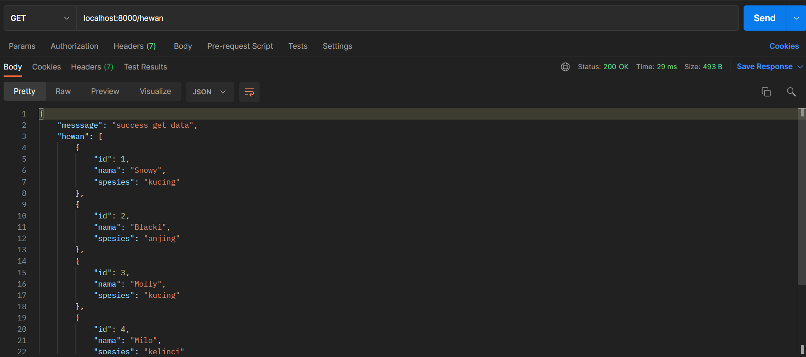
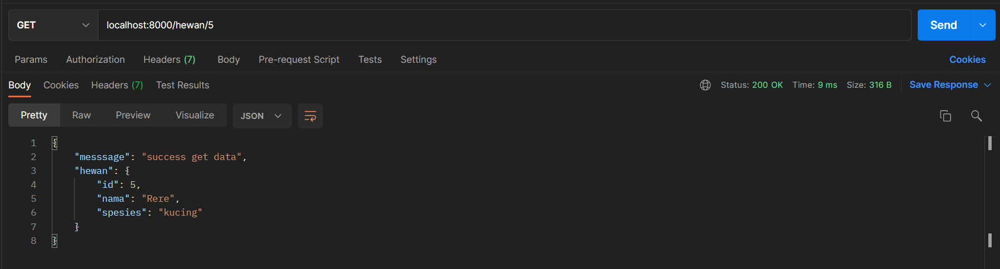
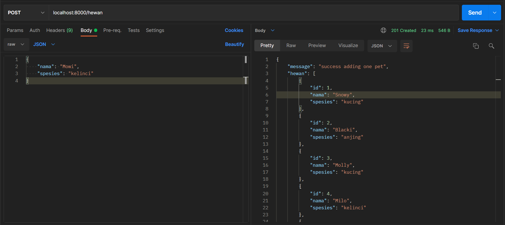
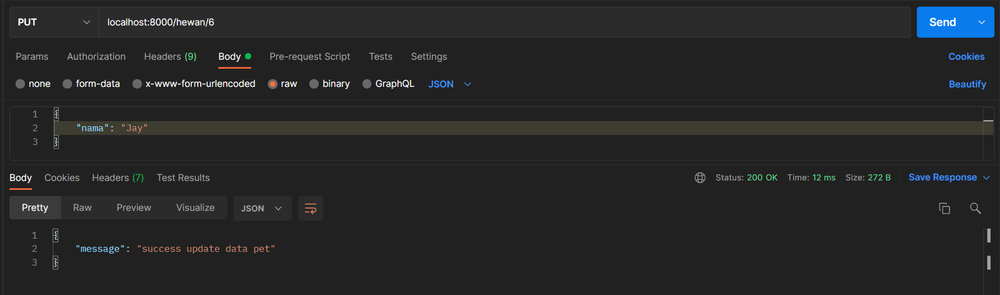
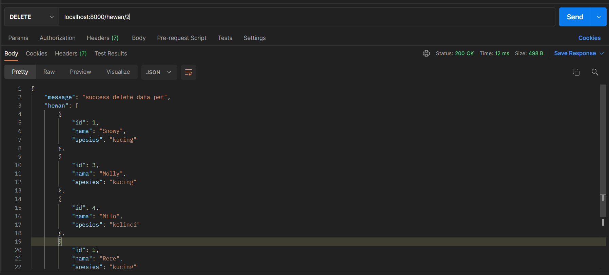
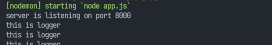
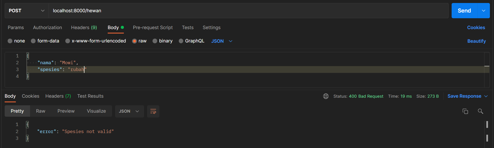

## Result

Codesandbox Link: https://codesandbox.io/s/25-express-routing-and-middleware-bdns4

1. Soal - 01
- Get ALL 

- Get by ID 

- Post

- Update

- Delete

2. Soal - 02
- Middleware Logger   

- Middleware Post Checker
