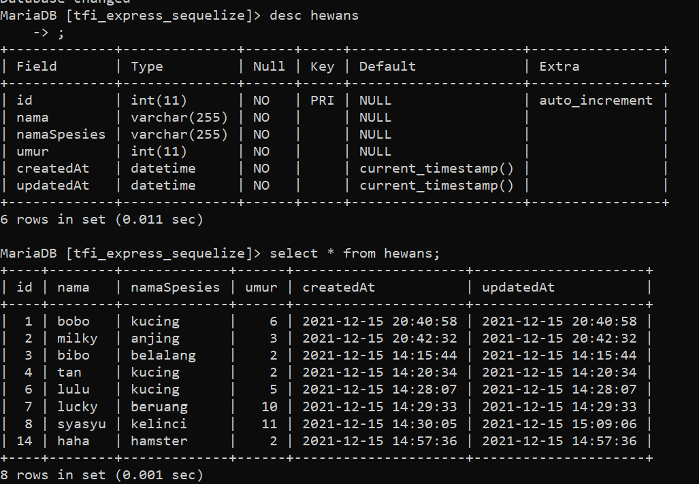
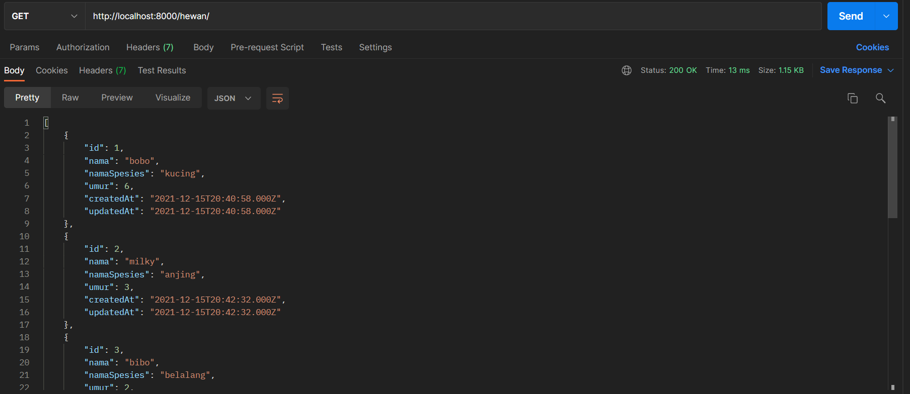
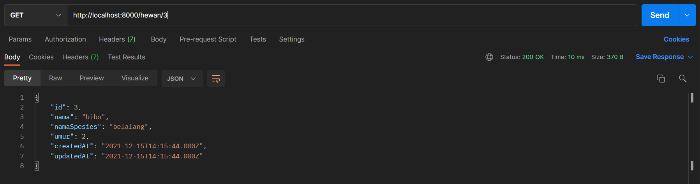
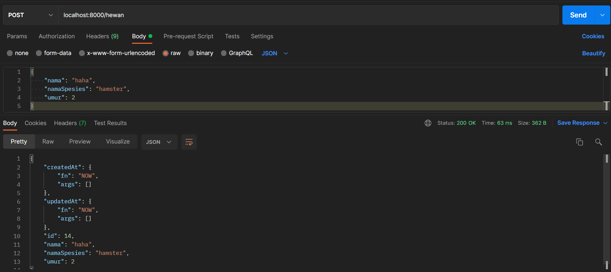
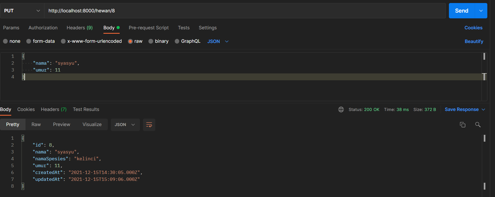
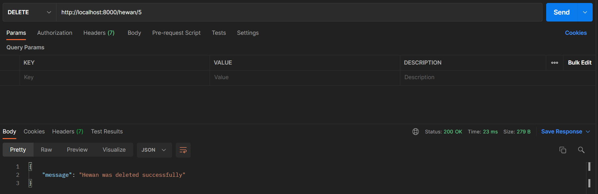

# Get Started

**Environment**
```
PORT=
DB_NAME=
DB_USERNAME=
DB_PASSWORD=
```

Run with `npm run dev`

### Post Request Body
```json
{
  "nama": "string",
  "namaSpesies": "String",
  "umur": Integer
}
```

### Put Request Body
```json
{
  "nama": "string",
  "namaSpesies": "String",
  "umur": Integer
}
```

### Database



### Try API








