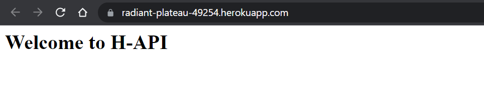
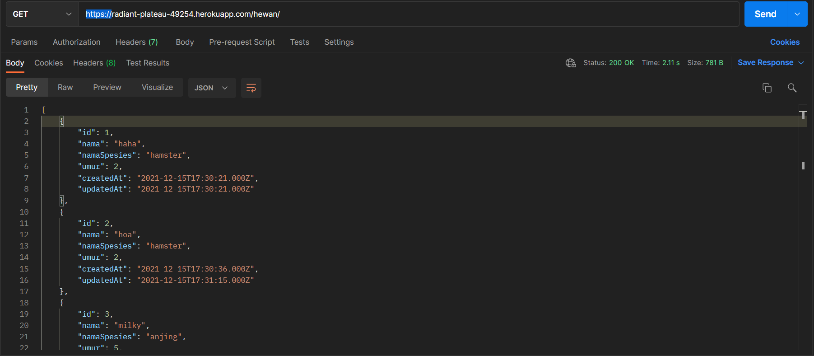
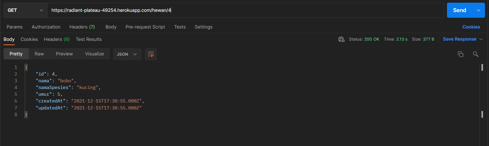
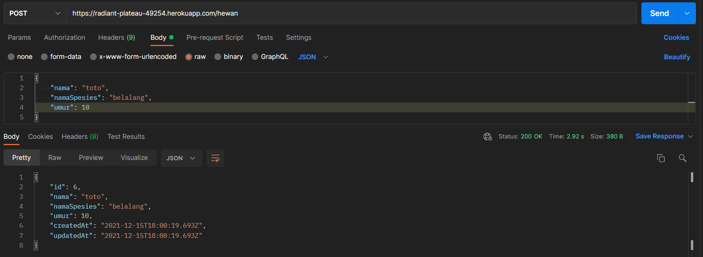
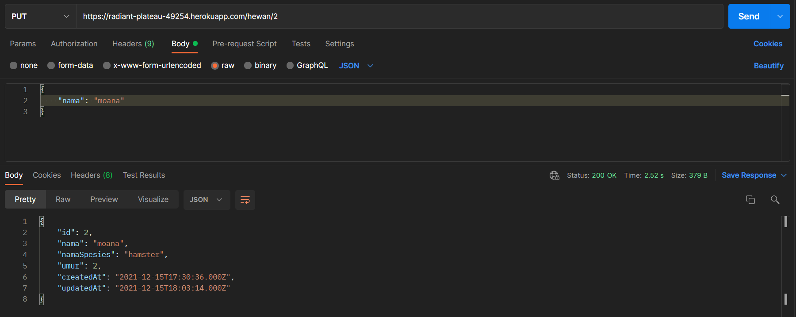
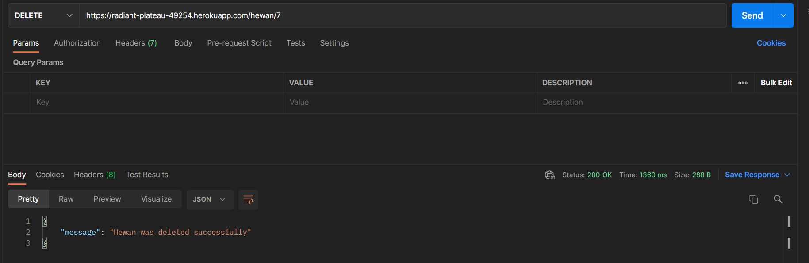

## Heroku URL
https://radiant-plateau-49254.herokuapp.com/



<br>

## Endpoint URL
**Get All**

https://radiant-plateau-49254.herokuapp.com/hewan



<br>

**Get By ID**

https://radiant-plateau-49254.herokuapp.com/hewan/:id



<br>

**Post**

https://radiant-plateau-49254.herokuapp.com/hewan

Request Body
```json
{
  "nama": "string",
  "namaSpesies": "string",
  "umur": integer
}
```



<br>

**Put**

https://radiant-plateau-49254.herokuapp.com/hewan/:id



Request Body
```json
  {
  "nama": "string",
  "namaSpesies": "string",
  "umur": integer
}
```

<br>

**Delete**

https://radiant-plateau-49254.herokuapp.com/hewan/:id

